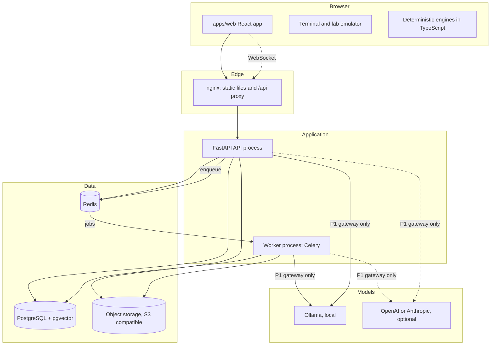
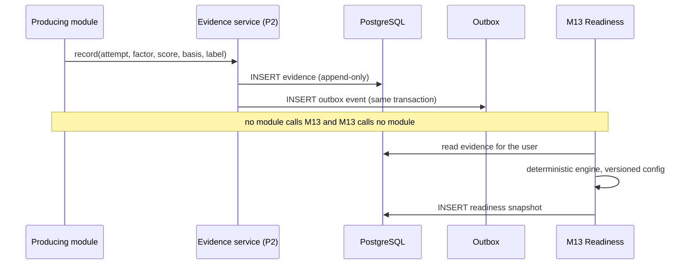

# OPSFORGE: System architecture

Status: **Proposed, awaiting approval.** Written 2026-10-09 against the repository as it is today. Every section separates what is **built** from what is **designed only**, so a design is never mistaken for working code. Requirement IDs refer to [PRODUCT_REQUIREMENTS.md](PRODUCT_REQUIREMENTS.md) and module IDs (M01 to M16, P1 to P3) to [MODULE_CATALOG.md](MODULE_CATALOG.md).

Companion documents: [DOMAIN_MODEL.md](DOMAIN_MODEL.md), [DATA_ARCHITECTURE.md](DATA_ARCHITECTURE.md), [AI_ARCHITECTURE.md](AI_ARCHITECTURE.md), [SECURITY_ARCHITECTURE.md](SECURITY_ARCHITECTURE.md). Decisions are in [ADR](ADR/README.md); each section names the ADR that holds the reasoning.

## 1. Shape of the system

OPSFORGE is a **modular monolith**: one web client, one API codebase deployed as two processes (HTTP API and background worker) from the same image, one PostgreSQL database, Redis and an object store. There are no services to discover, no inter-service network calls and no distributed transactions. This is deliberate ([ADR-0002](ADR/0002-engineering-standards.md), [ADR-0003](ADR/0003-monorepo-and-modular-monolith.md)). The boundaries between contexts are enforced in code, so that extraction stays possible without being paid for now.



| Part | State |
| --- | --- |
| Web client, design system, 3D scenes, deterministic engines | **Built** |
| FastAPI API: health, accounts and sessions, readiness snapshots, security middleware | **Built** |
| PostgreSQL with the pgvector extension enabled; Alembic; Redis container | **Built** (Redis is health-checked, nothing uses it yet) |
| nginx static serving and `/api` proxy; Docker Compose for the whole stack | **Built**, verified in gate G9 |
| Worker process, object storage, WebSocket channel, AI gateway, retrieval | **Designed only** |
| Metrics, traces, audit log, authorization roles | **Designed only** |

## 2. Principles that decide design questions

These come from [PRODUCT_PRINCIPLES.md](PRODUCT_PRINCIPLES.md) and the ADRs. When two options are otherwise equal, these decide.

1. **Deterministic code decides scores** (PR-04, PR-05). No model sits between evidence and a score.
2. **Evidence is append-only** (PR-18, DAT-03 to DAT-08). Anything that recalculates reads history and writes new rows.
3. **One gateway for models** ([ADR-0006](ADR/0006-llm-providers-and-secrets.md)). Provider keys exist only in the API and worker environment.
4. **No user input is executed on a server** ([ADR-0007](ADR/0007-terminal-and-lab-sandbox.md)).
5. **Local first.** The product works with Docker Compose, a local model and no cloud account, and degrades to deterministic behaviour with no model at all.
6. **A boundary is a function call until proven otherwise.** A context is extracted into a service only for an independent scaling, security or release need (ADR-0002, section 14 below).

## 3. Frontend boundaries

Decision records: [ADR-0003](ADR/0003-monorepo-and-modular-monolith.md), [ADR-0004](ADR/0004-design-system.md).

```
packages/types    contract types and constants      no behaviour that needs I/O
packages/ui       design system (MUI + tokens)     no business rules, no fetch
packages/config   shared tsconfig and ESLint       build-time only
apps/web
  src/app         shell, routing, module registry   composes pages, owns navigation
  src/pages       one route-level container per screen   wires features to components
  src/features/<context>
      engine/     pure TypeScript, no React, no I/O      scoring, evaluation, generation
      repository  storage or API access behind an interface
      hooks       React state around an engine and a repository
      components  presentational pieces for this context
  src/visuals     shared 3D and timeline infrastructure
```

Rules:

- **Dependencies point one way:** `pages → features → packages`. `packages/ui` imports nothing from `apps/web`. A feature does not import another feature's internals; it uses that feature's public entry point, or goes through `@opsforge/types`.
- **No business logic in components** (ADR-0002 rule 8). Thresholds, weights, eligibility and scoring live in a feature's `engine` and reach components as props.
- **Engines are pure.** They take data and return data. They do not read the clock, storage or network; those are arguments. This is what makes them reproducible (NFR-DATA-04, NFR-MNT-02) and is why the readiness engine can be tested without a browser.
- **All network access goes through a typed client and a repository.** Components never call `fetch`. A repository hides whether data lives in the account (API) or the browser. The readiness snapshot repository is the pattern ([ADR-0005](ADR/0005-identity-and-persistence.md)); other modules copy it one at a time.
- **No secret reaches the browser.** No provider key, no model URL. The browser talks to `/api` only (NFR-SEC-02).
- **Heavy views are lazy.** 3D, React Flow and chart code load as route chunks, with a non-3D fallback (NFR-UX-04, PR-14).
- **Real time** uses one WebSocket client with typed messages ([ADR-0014](ADR/0014-realtime-channel.md)).

Built today: the layout above, with the engines for readiness, interview analysis, resume, JD, incident and architecture evaluation running in the browser. Open point: `apiSnapshots.ts`, `account` and `health` each make their own calls. A single client module is due when the second API-backed module lands.

### Where the deterministic engines run

Today every engine is TypeScript in the browser, and the API stores what the browser computed. That is acceptable while the user is the only party who relies on the result, and while evidence lives in the browser ([ADR-0007](ADR/0007-terminal-and-lab-sandbox.md) records the same stance for labs). It stops being enough when the server must recompute readiness over stored evidence for replay (DAT-07, RDY-11) or in a background job. [ADR-0013](ADR/0013-evidence-store-and-domain-events.md) records the position: TypeScript stays the reference implementation, shared fixtures define parity, and the server-side recompute option is decided when a feature needs it, not before.

## 4. Backend boundaries

Decision record: [ADR-0003](ADR/0003-monorepo-and-modular-monolith.md).

```
apps/api/app
  api/        HTTP only: routers, request and response mapping, dependencies
  services/   application use cases; orchestrate domain, persistence, jobs and the AI gateway
  domain/     pure rules and engines, no I/O, no framework imports        (to come)
  models/     SQLAlchemy models
  schemas/    Pydantic request and response models
  db/         engine, session, declarative base
  ai/         P1 gateway: providers, prompts, redaction, validation        (to come)
  workers/    Celery app and task entry points                              (to come)
  core/       settings, logging, security, middleware, rate limits
```

Rules:

- `api → services → domain`. Nothing in `domain` imports `api`, `db`, `ai` or a framework. A route handler contains no business rule.
- **A context owns its tables.** Another context reads them only through the owning context's service interface. No cross-context joins in application code, no foreign keys into another context's internal tables except to its identifier. The exception is the identity key `users.id`, which every user-owned table references.
- **Writes of evidence go through one service** (the evidence service in P2). Producers do not call M13 and M13 does not call producers (see section 7).
- **Importing the app opens no connection.** `create_app()` builds it; tests build it with their own settings.
- **Import boundaries are tested, not trusted.** An import-linter contract (layers above, plus "no context imports another context's `models`") will be added with the first second context in the API. Until then the API has one context and the rule is reviewed by hand.

Built today: `api`, `services`, `models`, `schemas`, `db` and `core` with two contexts (identity and readiness snapshots). `ai` and `workers` are empty packages, and `domain` has not been created yet.

### Context map

Contexts correspond to modules. Each is one package inside each layer (`services/documents`, `models/documents`).

| Context | Modules | Owns (see [DOMAIN_MODEL.md](DOMAIN_MODEL.md)) |
| --- | --- | --- |
| Identity and access | P2 | users, sessions, roles |
| Knowledge | M02, M09 | technologies, topics, skills, learning content, patterns |
| Documents | M03 | documents, chunks, provenance, stored objects |
| Cards | M04 | flashcards, reviews, schedules |
| Questions and scenarios | M05 | questions, attempts, scenarios, nodes |
| Incidents | M06, M14, M15 | incidents, incident evidence |
| Labs | M07 | labs, lab attempts |
| Architecture | M08 | scenarios, versions, components, findings, scores |
| Interview | M10 | sessions, rounds, questions, answers |
| Resume and JD | M11, M12 | claims, requirements |
| Behavioral | M16 | stories |
| Evidence and evaluation | P2 | evidence, evaluations, audit |
| Readiness | M13, M01 | snapshots, daily plans |
| AI platform | P1 | prompt versions, usage ledger |

The hard dependency order between contexts is the layered graph in [MODULE_CATALOG.md](MODULE_CATALOG.md#dependency-map), which is acyclic. Soft links (deep links, "create a card from this") go through service interfaces and may point anywhere.

## 5. Domain boundaries

Covered in detail in [DOMAIN_MODEL.md](DOMAIN_MODEL.md): bounded contexts, the 33 entities of DAT-02 plus the supporting ones this design adds, aggregates and invariants, domain events and the ubiquitous language. The rules that matter for architecture:

- **Content and attempts are separate.** Authored content (questions, scenarios, labs, rubrics) is versioned and shared. Attempts and evidence belong to a user and refer to a content version, so changing content never rewrites history.
- **Evaluation is separate from evidence** (DAT-04), and **AI reasoning is separate from the deterministic calculation** (DAT-05).
- **Every user-owned row carries `user_id`.** A workspace key is added when team features exist ([ADR-0010](ADR/0010-authorization-model.md)).

## 6. Persistence

Detail: [DATA_ARCHITECTURE.md](DATA_ARCHITECTURE.md). Decisions: [ADR-0005](ADR/0005-identity-and-persistence.md), [ADR-0011](ADR/0011-retrieval-and-vector-storage.md).

| Store | Holds | Source of truth? |
| --- | --- | --- |
| PostgreSQL | All structured data, including embeddings (pgvector) and job state | **Yes** |
| Object storage | Uploaded files and generated artifacts | Yes, for file bytes; metadata is in PostgreSQL |
| Redis | Queue, pub/sub, short-lived cache, shared rate limits | **No.** Losing it loses no data |
| Browser storage | Cache and offline copy; the legacy home of modules not yet moved | No, once a module is moved to the API |

PostgreSQL is the only store that must be backed up. Schema changes go through Alembic only. Test runs use SQLite for speed and migrations are checked against real PostgreSQL, which is why PostgreSQL-only features (triggers, pgvector) need their own tests.

## 7. Evidence flow



Modules report by writing evidence; M13 reads evidence. That is why M13 has no hard dependency on any producer. The outbox row lets background consumers (a snapshot recompute, the daily plan) react without the producer knowing they exist. Detail in [ADR-0013](ADR/0013-evidence-store-and-domain-events.md).

## 8. Background processing

Decision record: [ADR-0008](ADR/0008-background-processing.md). **Designed only.**

- A **worker process** runs the same code as the API from the same image with a different command. Celery with Redis as broker.
- Work that runs in a worker: document ingestion (parse, chunk, embed), model calls that can take more than a few seconds, evaluation batches, readiness recompute, scheduled maintenance, and any future lab orchestration (NFR-OPS-02).
- **Postgres owns job state.** A `jobs` row records the request, status, progress and result reference. Redis carries the message, not the truth. A lost message is recovered by a sweeper that re-enqueues stale `queued` jobs.
- Tasks are **idempotent** and take identifiers, not payloads. Retries use bounded exponential backoff and end in a `failed` state a person can see.
- Queues are separated by cost: `ingest`, `ai`, `default`. A slow model queue never delays a status update.
- Progress and results reach the browser over the WebSocket channel, with polling `GET /api/jobs/{id}` as the fallback (ADR-0014).

## 9. File storage

Decision record: [ADR-0009](ADR/0009-file-and-object-storage.md). **Designed only.**

- File bytes live in an **S3-compatible object store**: MinIO in the local Compose stack, any S3 service elsewhere (NFR-OPS-01, NFR-OPS-04). PostgreSQL holds the metadata (`stored_objects`: key, size, content type, SHA-256, owner, state).
- The browser uploads **to the API**, not directly to the store. The API checks size, type and the account, writes the object under a key derived from the owner and a random id, and enqueues ingestion. Direct presigned upload is a later optimisation, because it removes the chance to validate before storing.
- Objects are private. Downloads go through the API or a short-lived presigned URL after an authorization check. Nothing is served from a public bucket.
- Parsing of untrusted files (PDF, DOCX, Markdown, archives) happens in the worker with limits on time, memory and output size, never in the API process.

## 10. AI architecture

Full document: [AI_ARCHITECTURE.md](AI_ARCHITECTURE.md). Decision record: [ADR-0006](ADR/0006-llm-providers-and-secrets.md).

- **One gateway (P1) inside `apps/api`** is the only code that can reach a model. Callers pass a purpose id, a prompt version, a closed vocabulary and untrusted text, and get validated evidence or `unavailable`.
- **Providers:** Ollama (local, default), OpenAI and Anthropic (optional, off unless enabled and keyed). Routing is configuration.
- **RAG** retrieves from PostgreSQL (pgvector plus full-text) with SQL-level filters for owner and provenance, and returns chunk ids that the answer must cite ([ADR-0011](ADR/0011-retrieval-and-vector-storage.md)).
- **Deterministic evaluation** consumes evidence dimensions the model produced and turns them into evidence and scores. The model never emits a score.
- **Offline mode** makes every call return `unavailable`; every feature has a deterministic path.

## 11. Sandbox architecture

Decision record: [ADR-0007](ADR/0007-terminal-and-lab-sandbox.md). **Built for the emulated path; the container path is designed as a boundary only.**

| Zone | What runs | Reaches |
| --- | --- | --- |
| Browser tab | The terminal and lab emulator, over a serialisable world. No `fetch`, `fs`, `eval` or `child_process` path from command input | Nothing outside the tab |
| API and worker | Application code. **Never executes user-typed commands.** A test fails if a route accepting a command is added | PostgreSQL, Redis, object store, model gateway |
| Execution plane (future, not built) | Short-lived, rootless or microVM environments, one per attempt | A separate network with no route to the API, database or object store, and no credentials from them |

Adding the execution plane needs its own ADR meeting the conditions listed in ADR-0007. Until then no code path runs user input on the server. Its design requirements are in [SECURITY_ARCHITECTURE.md](SECURITY_ARCHITECTURE.md#11-execution-plane-future).

## 12. Authentication and authorization

Decision records: [ADR-0005](ADR/0005-identity-and-persistence.md) (authentication, built) and [ADR-0010](ADR/0010-authorization-model.md) (authorization, designed).

- **Authentication, built:** email and password (scrypt), opaque session token in an `httpOnly`, `SameSite=Lax` cookie, only its SHA-256 stored, 14-day sessions, login lockout, registration throttle. Same-origin by construction (Vite proxy in development, nginx in production).
- **Authorization, designed:** every route resolves an *actor* from the session, and every service call takes the actor. Repositories filter by `user_id` by default. Roles start as `user` and `admin` (operator). A policy function `can(actor, action, resource)` lives in the service layer so one place answers "may this happen". The isolation test suite creates two users and asserts that no route returns or changes the other's rows (NFR-SEC-01).
- **Later:** an external identity provider replaces only the "resolve actor from request" dependency. Workspaces and mentor roles add a `workspace_id` and role grants; PostgreSQL row-level security is added then as defence in depth.

## 13. Observability

Decision record: [ADR-0012](ADR/0012-observability.md). **Partly built.**

| Signal | Plan | State |
| --- | --- | --- |
| Logs | Structured JSON to stdout, one request id per request carried into workers, no secrets or prompt bodies | Partly built: logs go to stdout at a configurable level in a plain-text format. JSON format and request id are designed |
| Metrics | Prometheus `/metrics` on an internal-only port: request rate, latency, errors, job queue depth and age, model calls (latency, tokens, cost, provider, prompt version), login lockouts | Designed only |
| Traces | OpenTelemetry across web request, job and model call | Designed only |
| Health | `/api/health/live` and `/api/health/ready` | Built |
| Audit | A separate append-only `audit_log` for security-relevant events | Designed only |

Prometheus and Grafana run in Compose under an optional profile when metrics exist (NFR-OPS-01, NFR-OPS-03).

## 14. Deployment and the Kubernetes migration

Decision record: [ADR-0015](ADR/0015-kubernetes-migration-path.md).

**Today:** Docker Compose, named `opsforge-<service>`: `opsforge-postgres`, `opsforge-redis`, `opsforge-api`, `opsforge-web`. Plain `docker compose up` starts the data services; `--profile app` adds the API and web. Verified end to end (gate G9). Worker, object store and Ollama are not in the Compose file yet.

**Kubernetes is not adopted now.** It is a migration with an entry condition, and the design keeps it cheap:

| Property kept today | Why it matters later |
| --- | --- |
| API and worker are stateless; state is in PostgreSQL, Redis and object storage | Pods can be killed and scaled freely |
| Configuration only from environment variables | Maps to ConfigMaps and Secrets |
| `/live` and `/ready` health endpoints | Map to liveness and readiness probes |
| One image, two commands (API, worker) | Two Deployments from one build |
| Migrations are one command (`alembic upgrade head`); the image runs it at API start today, which is safe for one replica only | Move it to a Job or init step before the rollout |
| Non-root container, no writable local state | Passes a restricted pod security policy |
| In-process rate limiting is documented as a gap | Must move to Redis before a second replica |

**Extraction triggers** (any one, with a measured cause): a context needs a different scaling profile (embedding or evaluation throughput), a different security domain (the execution plane, section 11) or an independent release cadence. The first likely extractions are the worker pool and the execution plane, not the API contexts.

## 15. Cross-cutting rules

| Topic | Rule |
| --- | --- |
| Configuration | Environment only, `pydantic-settings`, no secret default, production guard refuses unsafe values |
| Errors | Typed errors map to a stable JSON error body; no stack traces or connection strings in responses |
| Time | UTC everywhere in storage; the clock is passed into engines |
| IDs | UUIDv4 primary keys; client-supplied ids only where idempotency needs them (snapshots) |
| API contract | OpenAPI generated by FastAPI; web types in `@opsforge/types`; client generation is a later step (NFR-MNT-04) |
| Content | Authored as versioned, schema-validated files and seeded; never edited by hand in the database (NFR-MNT-01) |
| Testing | Pure engines unit-tested; API tested on SQLite; PostgreSQL features tested against PostgreSQL; golden sets gate prompt changes |
| Versioning | Evaluators, rubrics, prompts and readiness config carry versions that are stored with results (NFR-MNT-03) |

## 16. What is deliberately not decided here

- **Hosted multi-user operation.** The design supports it (section 12), but availability targets, backup objectives and retention are open (TODO D-04).
- **Per-user provider keys.** Not supported ([ADR-0006](ADR/0006-llm-providers-and-secrets.md)).
- **Mobile apps, native clients, public API.** None are in the spec.
- **The execution plane.** Boundary only; needs its own ADR.

## 17. Phase mapping

| Phase | Architecture work it triggers |
| --- | --- |
| 06 Knowledge Domain | Content seeding pipeline, first context packages beyond identity, import-linter contract |
| 07 Documents and RAG | Worker process, object storage, `jobs`, retrieval schema, chunk and embedding tables |
| 08 Reading Mode and AI assistant | P1 gateway, `ai_usage`, prompts as files, WebSocket channel |
| 12 Question Engine | Evidence service and outbox; attempts and evaluations tables |
| 44 Security hardening | Roles, policy layer, isolation suite, audit log |
| 45 Testing | Playwright and axe, golden sets in CI |
| 46 to 48 Docker, Kubernetes, observability | Worker and MinIO in Compose, metrics and traces, the migration in ADR-0015 only if a trigger has fired |
