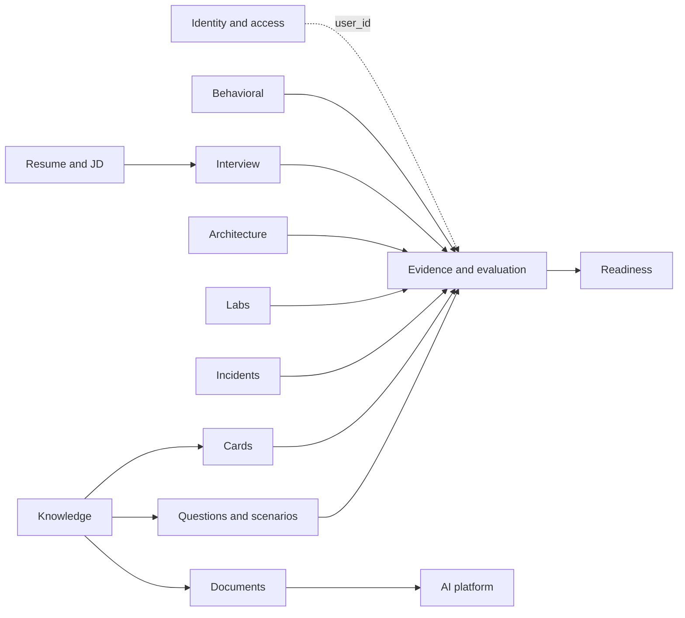
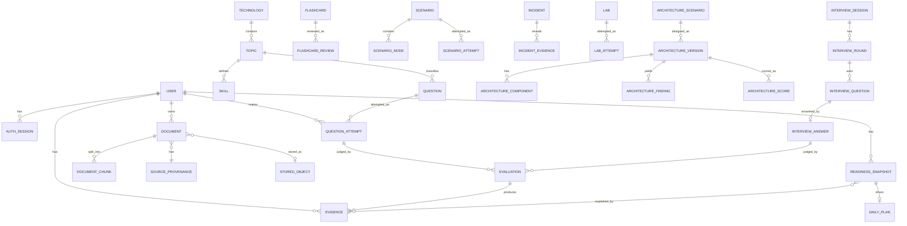

# OPSFORGE: Domain model

Status: **Proposed, awaiting approval.** Written 2026-10-09. This is the model the code grows into, not a description of tables that exist. Today two contexts are implemented in the API: identity (`users`, `auth_sessions`) and readiness snapshots (`readiness_snapshots`). Everything else is the target design that the PRD (DAT-01 to DAT-09) and the module catalog require.

Related: [ARCHITECTURE.md](ARCHITECTURE.md), [DATA_ARCHITECTURE.md](DATA_ARCHITECTURE.md), [MODULE_CATALOG.md](MODULE_CATALOG.md), [PRODUCT_REQUIREMENTS.md](PRODUCT_REQUIREMENTS.md) §4.19. The shared TypeScript contract is `packages/types/src/readiness.ts`.

## 1. Ubiquitous language

The words below mean one thing everywhere: in the spec, the code, the database and the UI.

| Term | Meaning |
| --- | --- |
| **Content** | Authored, versioned material shared by everyone: questions, scenarios, labs, patterns, rubrics, technology and topic definitions. Not owned by a user. |
| **Attempt** | A user's one try at a piece of content. Owned by a user, immutable once finished. |
| **Evidence** | One scored observation about one readiness factor, produced from an attempt. Immutable. One per (attempt, factor). |
| **Evaluation** | A judgement of an attempt or answer: which dimensions were met, by whom or what, with which evaluator version. Separate from the evidence it may produce (DAT-04). |
| **Basis** | How an evaluation or piece of evidence was produced: `deterministic`, `rule-based`, `mixed` or `llm-assisted`. Stored, shown, and never hidden. |
| **Provenance** | Where content came from: official documentation, personal note, runbook, AI generated, and so on (DAT-09). |
| **Factor** | One of the eleven readiness dimensions: knowledge, questions, flashcards, labs, troubleshooting, incidents, architecture, security, communication, interviews, confidence. |
| **Snapshot** | A frozen readiness report for one user at one time, computed from evidence with one engine and config version. Append-only. |
| **Engine / config version** | The identity of the deterministic code and weights that produced a score. Needed to reproduce it (DAT-07, NFR-DATA-04). |
| **Claim / Requirement** | A resume claim, or a requirement from a job description. Interview material, not evidence of skill. |

## 2. Bounded contexts

A context is a package inside each backend layer and a feature folder in the web app. Each context owns its tables and exposes a service interface. It maps to modules in [MODULE_CATALOG.md](MODULE_CATALOG.md).



Solid arrows are hard dependencies and match the acyclic layers in the module catalog. Every context depends on identity through `user_id`; that edge is dotted to keep the picture readable.

| Context | Modules | Responsibility | Aggregate roots |
| --- | --- | --- | --- |
| Identity and access | P2 | Who a user is, sessions, roles | User |
| Knowledge | M02, M09 | The map of technologies, topics, skills and patterns | Technology, Topic, Pattern |
| Documents | M03 | Source material, chunks, provenance, stored files | Document |
| Cards | M04 | Spaced-repetition cards and reviews | Flashcard |
| Questions and scenarios | M05 | Question bank, decision-tree scenarios, attempts | Question, Scenario |
| Incidents | M06, M14, M15 | Incident simulations and their evidence trail | Incident |
| Labs | M07 | Emulated hands-on labs and their event logs | Lab |
| Architecture | M08 | Designs, versions, findings, scores | Architecture Scenario |
| Interview | M10 | Sessions, rounds, questions, answers | Interview Session |
| Resume and JD | M11, M12 | Claims and requirements | Resume Claim, JD Requirement |
| Behavioral | M16 | Stories and their structure | Behavioral Story |
| Evidence and evaluation | P2 | The evidence store, evaluations, audit | Evidence, Evaluation |
| Readiness | M13, M01 | Snapshots, levels, daily plan | Readiness Snapshot, Daily Plan |
| AI platform | P1 | Prompt versions, model calls, usage ledger | Prompt Version, AI Usage |

Rules between contexts:

1. A context reads another's data only through that context's service interface, and references it by identifier.
2. **Producers do not call Readiness.** They write evidence (section 5). Readiness reads evidence.
3. Identity is the one shared key: every user-owned row has `user_id`.
4. Content contexts never reference attempts. Attempts reference content by `(id, version)`.

## 3. Entities by context

The 33 entities of DAT-02 are listed with the context that owns them. Entities marked **+** are supporting entities this design adds; the PRD does not name them but the requirements need them. They are not new features.

### 3.1 Identity and access

| Entity | Key facts | Invariants |
| --- | --- | --- |
| **User** | id, email (unique), password hash, display name, created at. Designed addition: account status | Email unique. The password hash never leaves the service layer. **Built** (without status). |
| **Auth session +** | id, user, token hash (unique), created at, expires at. Designed additions: last seen, client info | Only the SHA-256 of the token is stored. Expired rows are ignored; purging is not scheduled yet. **Built.** |
| **Role grant +** | user, role (`user`, `admin`), granted by, at | Every user has `user`. Roles are only added by an admin action that is audited. **Designed** ([ADR-0010](ADR/0010-authorization-model.md)). |

### 3.2 Knowledge

| Entity | Key facts | Invariants |
| --- | --- | --- |
| **Technology** | id, name, category, version of the content, facets (docs, practice, troubleshooting, architecture, interview) | Slug unique. Exists for all five facets, not only documents (PR-02, LRN-01). |
| **Topic** | id, technology, parent topic, name, difficulty | Belongs to exactly one technology. Hierarchy is acyclic. |
| **Skill** | id, topic, statement, level 1 to 6 | A skill is demonstrable: it names what a person can do. |
| **Pattern +** | id, name, problem, forces, consequences, related technologies | Authored content; versioned (M09). |

All knowledge content is authored as schema-validated files and seeded (NFR-MNT-01). Content has `version` and `content_hash`.

### 3.3 Documents

| Entity | Key facts | Invariants |
| --- | --- | --- |
| **Document** | id, owner (or system), title, **source/provenance type**, state (`uploaded`, `parsing`, `indexed`, `failed`), stored object, content hash | Provenance is required (PR-03, DOC-05). A user's document is visible only to that user. |
| **Document Chunk** | id, document, ordinal, text, token count, embedding, embedding model + version, heading path | Immutable. Re-chunking creates a new set under a new `index_version`; old chunks are kept until the re-index succeeds. |
| **Source / Provenance** | type (official, personal note, runbook, AI generated, interview question, incident, lab, architecture, interview), origin URL or description, licence note, retrieved at | Types are a closed set (DAT-09). Inherited by chunks and by anything generated from them. |
| **Stored object +** | id, owner, key, size, content type, SHA-256, state | Bytes live in object storage, metadata here ([ADR-0009](ADR/0009-file-and-object-storage.md)). |

### 3.4 Cards

| Entity | Key facts | Invariants |
| --- | --- | --- |
| **Flashcard** | id, owner, front, back, origin (hand-made, from wrong answer, generated), source provenance, topic | A generated card keeps the provenance of its source. |
| **Flashcard Review** | id, card, user, reviewed at, grade, interval before and after, scheduler version | Append-only. Scheduling state is derived from reviews, never edited. |

### 3.5 Questions and scenarios

| Entity | Key facts | Invariants |
| --- | --- | --- |
| **Question** | id, version, topic, type, level, stem, rubric (versioned), expected dimensions, provenance | Immutable per version. A rubric change makes a new version. |
| **Question Attempt** | id, user, question + version, answer, confidence, started, finished, time taken, hints used | Immutable once finished. Confidence is recorded **before** the result is shown (RDY-02). |
| **Scenario** | id, version, title, level, tags, entry node | A directed graph with one entry and reachable terminal nodes. |
| **Scenario Node** | id, scenario, prompt, choices, effects, terminal flag | Choices point to nodes in the same scenario. |
| **Scenario Attempt** | id, user, scenario + version, path taken (ordered node ids), result | Immutable once finished. |

### 3.6 Incidents

| Entity | Key facts | Invariants |
| --- | --- | --- |
| **Incident** | id, version, title, systems, timeline of facts, hidden root cause, tools available | Authored. The hidden cause is never sent to the client before the end of the attempt. |
| **Incident Evidence** | id, attempt, kind (log, metric, trace, command output), content, revealed at | What the user asked for and when. Reveal order is part of the score (PR-11). |

### 3.7 Labs

| Entity | Key facts | Invariants |
| --- | --- | --- |
| **Lab** | id, version, objective, starting world, checks, hints policy, **environment = emulated** | The environment type is explicit and shown to the user (PR-08, ADR-0007). |
| **Lab Attempt** | id, user, lab + version, ordered command and event log, check results, hints used | The event log is the evidence. Scoring is a pure function of the log. |

### 3.8 Architecture

| Entity | Key facts | Invariants |
| --- | --- | --- |
| **Architecture Scenario** | id, version, requirements (users, traffic, availability, RPO, RTO, budget) | Requirements are explicit and required (PR-10). |
| **Architecture Version** | id, user, scenario, number, graph (components and links), created | Versions of a design are kept; a new edit is a new version. |
| **Architecture Component** | id, version, kind, config, position | Belongs to one version. |
| **Architecture Finding** | id, version, rule id, severity, explanation, rule set version | Produced by deterministic rules; carries the rule version. |
| **Architecture Score** | id, version, dimension scores, rule set version | Derived and reproducible. |

### 3.9 Interview

| Entity | Key facts | Invariants |
| --- | --- | --- |
| **Interview Session** | id, user, mode, started, ended, setup (role, level, resume and JD refs) | Hints and scores are hidden during the session (INT-04, INT-05). |
| **Interview Round** | id, session, kind, ordinal | Ordered within a session. |
| **Interview Question** | id, round, source (bank, resume claim, JD requirement, follow-up), text | A follow-up links to the answer that caused it. |
| **Interview Answer** | id, question, text or transcript, confidence, duration | Immutable. |

### 3.10 Resume, JD, Behavioral

| Entity | Key facts | Invariants |
| --- | --- | --- |
| **Resume Claim** | id, user, document, claim text, technologies, depth rating needed | A claim is something to defend, not a score. |
| **JD Requirement** | id, user, document, requirement text, technology, priority | Maps to the knowledge graph. |
| **Behavioral Story** | id, user, title, situation, task, action, result, reflection, tags | Stored structure; quality is evidence only when practised aloud or in an interview. |

### 3.11 Evidence and evaluation

| Entity | Key facts | Invariants |
| --- | --- | --- |
| **Evaluation** | id, subject (attempt or answer), evaluator id and version, dimensions met, **basis**, label, model call ref (if any), created | Immutable. Several evaluations can exist for one subject; re-evaluation adds one. |
| **Evidence +** | id, user, attempt ref, **factor**, score 0 to 100, origin, basis, evaluation ref, content version, occurred at, recorded at | One per (attempt, factor). Never updated or deleted. A correction is a new row that supersedes by reference. |
| **Audit event +** | id, actor, action, subject, at, request id, outcome | Append-only; separate from evidence. **Designed.** |
| **Outbox event +** | id, type, payload, created, processed at | Written in the same transaction as the change it announces. |

### 3.12 Readiness

| Entity | Key facts | Invariants |
| --- | --- | --- |
| **Readiness Snapshot** | id, user, client snapshot id, taken at, config version, fingerprint, evidence count, overall, level, factors (JSONB), created at | **Append-only; a database trigger rejects UPDATE.** Idempotent on (user, snapshot id). **Built.** The engine version is not a column yet: it is carried inside the config version string, and a dedicated column is a migration to add when evidence is stored server-side. |
| **Daily Plan** | id, user, date, ordered actions with reasons and the evidence each rests on | Derived from a snapshot. Replaceable by a later plan for the same day, but earlier ones are kept. |

### 3.13 AI platform

| Entity | Key facts | Invariants |
| --- | --- | --- |
| **Prompt version +** | id, purpose, version, content hash, golden-set result | Prompts are files in the repo; this row records which hash ran. |
| **AI usage +** | id, user, purpose, provider, model, prompt version, tokens in and out, cost, latency, outcome, at | Append-only ledger; drives budgets and metrics. Holds no prompt or response text. |
| **Job +** | id, type, subject, status, progress, attempts, error, created, finished | State is in PostgreSQL; the queue only carries the id ([ADR-0008](ADR/0008-background-processing.md)). |

## 4. Entity relationships



The diagram shows ownership and navigation. Attempt-to-content links carry a version, which a plain ER line cannot show.

## 5. Evidence, evaluation and snapshot

This is the spine of the product, and the three are kept apart on purpose.

```
attempt  ──►  evaluation  ──►  evidence  ──►  snapshot
(what the     (what was met,    (one scored    (the engine's result
 user did)     by what, how)     observation     over all evidence,
                                 per factor)     with its version)
```

1. **Attempt** is raw. It is stored exactly as it happened (DAT-03, DAT-06).
2. **Evaluation** says which dimensions were met and how it knows. A rule-based evaluator, a deterministic check or a model may produce it. A model output is accepted only as validated dimensions, never as a number the user sees as a score ([AI_ARCHITECTURE.md](AI_ARCHITECTURE.md)). The evaluator's identity and version are stored.
3. **Evidence** is the evaluation converted by deterministic code into a score for one factor, with `origin` and `basis`.
4. **Snapshot** is the readiness engine run over evidence. It stores its engine and config version and a fingerprint of its inputs, so the result is reproducible.

Consequences:

- Re-evaluation (a new rubric, a better evaluator) adds evaluations and new evidence. It never changes old rows (DAT-07, DAT-08).
- A snapshot explains itself by listing the evidence ids it used (RDY-08, NFR-DATA-03).
- Evidence with `basis = llm-assisted` is shown as such and can be weighted down by the engine's config, but it is evidence, not a verdict (PR-05).
- Reading, opening or finishing content creates no evidence (PR-01).

## 6. Provenance rules

- Every document and chunk has one provenance type from the closed set in DAT-09.
- Generated material (a card from a chunk, a question set from a document) **inherits** the provenance of its source and adds `AI generated` with the generating prompt version and model call reference.
- The UI shows provenance next to any generated or retrieved text. A citation is a chunk id, and retrieval answers must cite chunks or say they cannot (AI-05).
- Official-source content is read-only in the product. A user's edit to it creates a personal note.

## 7. Consistency with `@opsforge/types`

The web contract in `packages/types/src/readiness.ts` is the current shape of the evidence and snapshot concepts.

| Domain term | TypeScript type | Note |
| --- | --- | --- |
| Factor | the eleven-factor union | Same names in the database enum |
| Origin / basis | `EvidenceOrigin`, `EvidenceBasis` | Four basis values stored as given |
| Evidence | `ReadinessEvidence` | One scored observation per (attempt, factor) |
| Snapshot | the readiness report (engineVersion, configVersion, fingerprint, levels 1 to 6 with gates, calibration, next actions) | Stored today as indexed columns plus a `factors` JSONB document; levels, gates and next actions are not stored server-side today |

Rule: a domain concept has one definition. The Python Pydantic schema is generated from or checked against the OpenAPI document, and the TypeScript type is the web-side mirror (NFR-MNT-04). A change to the evidence or snapshot shape bumps the engine or config version and adds a migration; it does not edit stored rows.

## 8. Invariants checked by tests

| Invariant | Where enforced |
| --- | --- |
| Snapshots are never updated | Database trigger (built) and a test |
| One evidence row per (attempt, factor) | Unique constraint |
| Evidence has user, factor, basis and evaluator version | Not-null constraints and schema |
| A user cannot read another user's attempts, evidence, snapshots or documents | Isolation suite (phase 44) |
| An attempt references a content version that exists | Foreign key on (id, version) |
| A generated item keeps its source's provenance | Service rule and test |
| A model call never writes a score | Gateway returns validated dimensions only; no code path from gateway to a score column |
| Reading content writes no evidence | Producing services are the only writers; content readers have no write path |

## 9. Open points

- **Naming of "Evidence".** DAT-02 lists "Evaluation" and "Incident Evidence" but not a general evidence entity, while DAT-01 and the readiness contract rely on evidence. This model adds `Evidence` as the supporting entity. It does not change the 33.
- **Concurrency of Daily Plan versions.** Whether a plan can be regenerated within a day, or only once, is a product decision (CMD-03). The model allows both.
- **Teams.** Mentor and workspace entities (FUT-13, FUT-14, FUT-23) are not modelled. The decision in [ADR-0010](ADR/0010-authorization-model.md) to carry a `workspace_id` later is the only provision.
