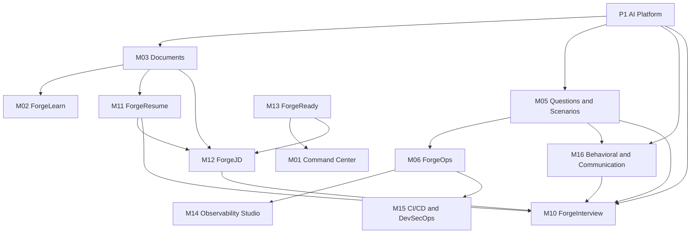

# OPSFORGE — Module Catalog

One entry per module. Nothing is merged or simplified: the 16 product modules (M01–M16) and the 3 cross-cutting platform modules (P1–P3) are the same ones as [PRD §3](PRODUCT_REQUIREMENTS.md#3-module-inventory). The dependency map is the last section.

How to read an entry:

- **Requirements**: PRD IDs the module owns.
- **Inputs**: what the module consumes (data, other modules, user input).
- **Evidence produced**: what it writes to the Evidence & Data Platform (P2), tagged with the readiness dimension it feeds (RDY-01: Knowledge, Practice, Hands-on, Troubleshooting, Architecture, Security, Communication, Confidence, Incident response). Modules that produce no evidence say so.
- **Status**: today, against the repo (Built / Partial / Not started). Phases refer to the 50-phase sequence in [IMPLEMENTATION_ROADMAP.md](IMPLEMENTATION_ROADMAP.md).

Cross-cutting requirements (PR-*, NFR-*, VIS-01, SYS-*) apply to every module and are not repeated per entry.

## Platform modules

### P1 AI Platform

- **Purpose**: the only gateway to language models. Provider abstraction (Ollama, OpenAI, Anthropic), RAG generation, evaluation pipeline that returns evidence dimensions (never a final score), prompt and version management, guardrails, redaction, cost caps, offline mode.
- **Requirements**: AI-01..AI-06, NFR-AI-01..04, NFR-SEC-09, NFR-SEC-10, NFR-PERF-03.
- **Inputs**: prompts from calling modules, retrieved chunks (from M03), provider configuration and keys (server side only), P2 for logging evaluations and prompt versions.
- **Evidence produced**: evaluations (dimension judgments with the prompt/model version) stored separately from evidence (DAT-04, DAT-05). No scores.
- **Status**: Partial. The `LlmProvider` interface exists; no provider is registered. Phases 08, 38. Gates G5, G6.

### P2 Evidence & Data Platform

- **Purpose**: the system of record. Core entities (33), technology/topic/skill taxonomy, provenance, append-only evidence, evaluations, readiness snapshots, replay, audit log, persistence and identity.
- **Requirements**: DAT-01..DAT-09, NFR-DATA-01..04, NFR-SEC-01..04, NFR-SEC-08, NFR-MNT-01, NFR-MNT-04, SYS-01..SYS-04.
- **Inputs**: writes from every module; schema-validated content files (questions, scenarios, labs, patterns, rubrics).
- **Evidence produced**: none itself; it stores all evidence and exposes it read-only to M13.
- **Status**: Partial. Shared TypeScript types exist and data is held in browser storage; there is no API persistence or auth yet. Gate G4.

### P3 Design System & Motion

- **Purpose**: theme, tokens, shared components, icons, motion primitives, 3D scene shell, reduced-motion handling, navigation structure, accessibility baseline.
- **Requirements**: UX-01..UX-14, NAV-01, NFR-UX-01..04, NFR-PERF-01, PR-13..PR-15.
- **Inputs**: none (design tokens, ADR-0004).
- **Evidence produced**: none.
- **Status**: Built (Phases 04, 43). Light theme default, dark theme alternative, Framer Motion primitives, shared R3F scene shell, GSAP playback.

## Product modules

### M01 Command Center

- **Purpose**: the daily home. Shows the readiness ring, skill metrics, today's plan, skill matrix, continue-training links, adaptive recommendations and recent evidence.
- **Requirements**: CMD-01..CMD-08.
- **Inputs**: the latest readiness report and plan (M13), recent evidence (P2), resumable work from M06, M08, M10.
- **Evidence produced**: none. It only reads.
- **Status**: Partial. Shell and layout built; it still shows labelled sample data (gate G7). Phase 05.

### M02 ForgeLearn (Knowledge Hub)

- **Purpose**: one hub per technology with 13 facets (Learn, Documentation, Mind Maps, Infographics, Flashcards, Questions, Commands, Troubleshooting, Incidents, Architecture, Labs, Interview, Progress). Owns concept content, learning paths, mind maps, infographics, command references and troubleshooting workflows.
- **Requirements**: LRN-01..LRN-13.
- **Inputs**: topic and technology taxonomy (P2), documents and reading surface (M03), authored content files, per-technology progress from P2. Facets for flashcards, questions, incidents, architecture, labs and interview link to M04, M05, M06, M08, M07, M10.
- **Evidence produced**: Knowledge (learning-path steps, low weight by PR-01/PR-02: reading alone is never proficiency), Confidence (self-rating per topic).
- **Status**: Not started (Phases 06, 09, 11).

### M03 Documents

- **Purpose**: ingest official and personal material, preserve provenance, chunk and index for retrieval, and host Reading Mode with context-aware AI actions.
- **Requirements**: DOC-01..DOC-11.
- **Inputs**: uploads and pasted text (official docs, resume, runbooks, notes, JDs, company material), embeddings and generation via P1, object storage, background workers.
- **Evidence produced**: none for proficiency. It produces provenance-typed documents and chunks that other modules cite. Reading time is logged as low-weight Knowledge only.
- **Status**: Not started. Resume and JD text are pasted into M11 and M12 and kept in browser storage (Phases 07, 08).

### M04 ForgeCards

- **Purpose**: flashcards for concepts, commands, differences, architecture and troubleshooting, scheduled by spaced repetition, with weak-card tracking and review history.
- **Requirements**: CRD-01..CRD-06.
- **Inputs**: card content (authored, from reading selections in M03, from wrong answers in M05), review results, scheduling state (P2).
- **Evidence produced**: Knowledge and Practice (recall accuracy, per review), Confidence (rating on each review).
- **Status**: Not started (Phase 10).

### M05 Questions & Scenario Engine

- **Purpose**: question bank and taxonomy (9 types, L1–L4), attempts and evaluation, adaptive difficulty, scenario graph (problem → investigation → paths → evidence → root cause → remediation → prevention → follow-ups), clarifying-question reward, wrong-answer analytics and the remediation sequence.
- **Requirements**: QST-01..QST-14.
- **Inputs**: question and scenario content files, the candidate's answers, evaluation dimensions from P1 (with a deterministic fallback), the technology taxonomy (P2).
- **Evidence produced**: Knowledge, Practice, Troubleshooting, Architecture, Security (by tag), Confidence (per attempt).
- **Status**: Not started as a bank. Scenario-graph ideas are used inside M06 only (Phases 12, 13, 14).

### M06 ForgeOps (Incident Simulator & Chaos)

- **Purpose**: operations-console incident simulation. Progressive evidence, terminal and telemetry, hypotheses, mitigation, RCA, prevention, chaos timeline, security incidents, replay.
- **Requirements**: OPS-01..OPS-12.
- **Inputs**: incident scenarios (graph from M05's engine), the candidate's commands and notes, architecture failure hand-off from M08 (ARC-14), optional terminal engine from M07.
- **Evidence produced**: Troubleshooting (the 11 §B criteria), Incident response, Communication (status updates), Security (security incidents). Raw evidence is replayable (OPS-11).
- **Status**: Built for the first scenarios, including the leaked-credential security incident and replay (Phases 26, 27). Partial for chaos breadth (25) and security incidents (33).

### M07 ForgeLab (Hands-on Labs & Terminal)

- **Purpose**: interactive terminal and hands-on labs with an isolated, resettable, observed sandbox. Owns the terminal engine (kubectl, docker, terraform, git, curl, dig, nslookup, ss, netstat, journalctl, top, systemctl, aws, az, helm, argocd).
- **Requirements**: LAB-01..LAB-07, NFR-SEC-05..07.
- **Inputs**: lab definitions, the candidate's commands, sandbox runtime (gate G8 decides browser emulation or containers).
- **Evidence produced**: Hands-on (kept separate from theory, PR-08), plus Troubleshooting by lab tag.
- **Status**: Not started (Phases 28, 29).

### M08 ForgeArchitect (Architecture Studio)

- **Purpose**: requirements-first visual architecture design with a component library and inspector; deterministic rules plus AI review; 12-dimension scorecard; versioning; failure injection; trade-off simulator; cost estimator; security review.
- **Requirements**: ARC-01..ARC-16.
- **Inputs**: architecture scenario with requirements, the candidate's graph, rule set (deterministic), optional semantic review (P1), pattern suggestions (M09), cost data.
- **Evidence produced**: Architecture (scorecard per version), Security (security review findings). Findings stay separate from the score (ARC-07).
- **Status**: Partial. Canvas, inspector, deterministic scorecard, versioning and failure simulation exist (Phases 16, 18, 19, 21, 25). Not started as standalone: requirements engine, trade-off simulator, cost estimator, security review (Phases 17, 22, 23, 24).

### M09 Patterns

- **Purpose**: architecture pattern library (14 patterns), each with problem, pattern, architecture, when to use, when not to use, trade-offs, real-world example and interview questions.
- **Requirements**: PAT-01..PAT-03.
- **Inputs**: authored pattern files; links into M05 questions and M08 components and rules.
- **Evidence produced**: Architecture and Knowledge (pattern questions, answered through M05).
- **Status**: Not started (Phase 20).

### M10 ForgeInterview

- **Purpose**: dynamic AI interviewer; technical, architecture, troubleshooting and behavioral rounds; Full Interview Day (6 rounds); Emergency Mode; scores hidden until the end; replay; later voice.
- **Requirements**: INT-01..INT-11.
- **Inputs**: question bank and follow-up logic (M05), resume claims (M11), JD requirements (M12), STAR stories (M16), model calls (P1), optionally architecture and incident rounds from M08 and M06.
- **Evidence produced**: Communication, Confidence, and the technical dimensions each answer is tagged with (Knowledge, Architecture, Troubleshooting, Incident response). Full transcript kept for replay (INT-07).
- **Status**: Partial. Interviewer, timed rounds, debrief and replay timeline exist (Phases 38, 39 partial, 40 partial). Not started: full multi-round simulation, Emergency Mode (41), cross-session analytics.

### M11 ForgeResume (Resume Interrogation)

- **Purpose**: turn each resume claim into interview paths and track whether the claim is defensible. Also extracts tools and technologies from the resume.
- **Requirements**: RSM-01..RSM-05.
- **Inputs**: resume text (M03 ingestion; today pasted), the tool and technology catalog, readiness per tool (M13).
- **Evidence produced**: Resume Claim entities and claim-defensibility (Knowledge, Communication) once the claim is questioned in M10.
- **Status**: Built (Phase 34).

### M12 ForgeJD (JD Analyzer)

- **Purpose**: extract technologies, responsibilities and priorities from a job description; show weighted priorities; compare against current readiness and resume; generate JD-specific questions and a preparation plan.
- **Requirements**: JDA-01..JDA-05.
- **Inputs**: JD text (M03; today pasted), the resume view (M11), the readiness report (M13), the tool and technology catalog.
- **Evidence produced**: JD Requirement entities (targets and weights, not proficiency evidence). Missing-evidence list feeds M13 recommendations.
- **Status**: Built (Phase 35).

### M13 ForgeReady (Readiness Engine)

- **Purpose**: turn evidence into an explainable, deterministic readiness report: 9 dimensions, knowledge-vs-confidence split, 6 levels with evidence thresholds, daily adaptive plan, snapshots, trend, wrong-answer analytics.
- **Requirements**: RDY-01..RDY-11.
- **Inputs**: only evidence from P2. It never calls a model.
- **Evidence produced**: none. It produces readiness snapshots (immutable) and plans.
- **Status**: Built as an engine (Phase 15); the evidence for knowledge, questions, flashcards and labs is still empty. Daily plan is Phase 42.

### M14 Observability Studio

- **Purpose**: design observability coverage (logs, metrics, traces, OpenTelemetry, Prometheus, Grafana, Loki/ELK, Jaeger/Tempo) and troubleshoot simulated failures from telemetry.
- **Requirements**: OBS-01..OBS-04.
- **Inputs**: simulated failures and telemetry from M06, the candidate's coverage design.
- **Evidence produced**: Troubleshooting and Incident response (telemetry-driven diagnosis), Architecture (observability dimension).
- **Status**: Not started (Phase 30). Navigation placement is an open decision (PRD §3).

### M15 CI/CD & DevSecOps Studio

- **Purpose**: pipeline designer (Git → … → Production), decisions about scans, approvals, secrets, rollback, canary and artifact promotion; DevSecOps coverage across IAM, RBAC, secrets, KMS, TLS, SAST/DAST/SCA/SBOM and supply-chain security.
- **Requirements**: CIC-01..CIC-04.
- **Inputs**: pipeline scenario and the candidate's design; security incidents are delivered through M06.
- **Evidence produced**: Security, Practice, and Architecture (CI/CD dimension).
- **Status**: Not started (Phases 31, 32, 33 partial). Navigation placement is an open decision.

### M16 Behavioral, Communication & Experience

- **Purpose**: behavioral topics, answer frameworks, communication coach, personal experience (STAR) database, questions generated from the user's own experience, later voice analysis.
- **Requirements**: BEH-01..BEH-06.
- **Inputs**: the user's stories, behavioral questions (M05), evaluation dimensions (P1), later transcription.
- **Evidence produced**: Communication, Confidence, and leadership evidence (PR-12). Behavioral Story entities.
- **Status**: Not started (Phases 36, 37). Navigation placement is an open decision.

### Future requirements (FUT-01..FUT-23)

Not a module. Each belongs to an owner: FUT-01, FUT-12, FUT-22 → M10/M13; FUT-02, FUT-03, FUT-05, FUT-06 → M07; FUT-04 → M08; FUT-07 → M06; FUT-08 → M08/M09; FUT-09..FUT-11, FUT-15..FUT-17 → M05/M13; FUT-13, FUT-14, FUT-23 → P2 (multi-tenant) plus the relevant module; FUT-18 → M13; FUT-19 → M13 + M02; FUT-20 → M02; FUT-21 → M13. The data model must not preclude them (PRD §4.20).

## Dependency map

### Rules

- A **hard** dependency means the module cannot be built or run without the other (it reads its data or code). Hard dependencies must form a directed acyclic graph.
- A **soft** dependency is a link, hand-off or optional enhancement (deep link, "create a flashcard", AI assistance). The module still works if the target is absent. Soft edges are allowed to point anywhere, because they are not build-order constraints.
- **Every module needs P2 (Evidence & Data Platform) and P3 (Design System & Motion).** These are not repeated below.
- Modules do not call each other to report evidence. They write to P2, and M13 reads P2. This is why M13 has no hard dependency on any producer.

### Hard dependencies (besides P2 and P3)

| Module | Needs | Needed by |
| --- | --- | --- |
| P1 AI Platform | none | M03, M05, M10, M16 |
| M01 Command Center | M13 | none |
| M02 ForgeLearn | M03 | none |
| M03 Documents | P1 | M02, M11, M12 |
| M04 ForgeCards | none | none |
| M05 Questions & Scenario Engine | P1 | M06, M10, M16 |
| M06 ForgeOps | M05 | M14, M15 |
| M07 ForgeLab | none | none |
| M08 ForgeArchitect | none | none |
| M09 Patterns | none | none |
| M10 ForgeInterview | P1, M05, M11, M12, M16 | none |
| M11 ForgeResume | M03 | M10, M12 |
| M12 ForgeJD | M03, M11, M13 | M10 |
| M13 ForgeReady | none | M01, M12 |
| M14 Observability Studio | M06 | none |
| M15 CI/CD & DevSecOps Studio | M06 | none |
| M16 Behavioral & Communication | P1, M05 | M10 |

P2 is needed by every other module; P3 by every module with a UI (all of M01–M16).

### Soft dependencies

| From | To | Reason |
| --- | --- | --- |
| M03 | M04, M05, M02 | Reading Mode actions: create flashcard, generate question, add note, connect related topics (DOC-08) |
| M02 | M04, M05, M06, M07, M08, M10 | Hub facets deep-link filtered by technology (LRN-06) |
| M04 | M05 | Cards created from wrong answers (CRD-04) |
| M05 | P1 | Semantic evaluation; deterministic fallback when absent |
| M06 | M07 | Shared terminal engine; M06 has its own simulated console until M07 delivers it |
| M06 | P1 | Optional narration and RCA evaluation |
| M08 | M06 | Failure-simulation hand-off (ARC-14) |
| M08 | M09 | Suggested patterns on findings |
| M08 | P1 | Semantic architecture review (ARC-07) |
| M09 | M05, M08 | Pattern interview questions, components and rules |
| M10 | M06, M07, M08 | Incident, lab and architecture rounds |
| M13 | M04, M05, M06, M07, M08, M10 | Daily-plan items deep-link to the module that closes a gap |
| M01 | all product modules | Continue training, recent evidence |
| M11 | M10 | "Start interrogation" opens an interview round |

### Layers (build order from the hard graph)

| Layer | Modules |
| --- | --- |
| 0 | P2, P3 |
| 1 | P1, M04, M07, M08, M09, M13 |
| 2 | M01, M03, M05 |
| 3 | M02, M06, M11, M16 |
| 4 | M12, M14, M15 |
| 5 | M10 |

A module may start once everything in the layers above it that it needs is ready. Modules in the same layer have no hard dependency on each other and can be built in any order.

### Diagram (hard dependencies only; P2 and P3 omitted because every module needs them)

Arrows point from the module that is needed to the module that needs it. M04, M07, M08 and M09 have no hard dependencies and nothing depends on them hard, so they are not drawn.

### Acyclicity check

Topological order that satisfies every hard edge: P2, P3, P1, M04, M07, M08, M09, M13, M01, M03, M05, M02, M06, M11, M16, M12, M14, M15, M10. All 19 modules are placed, so there is no cycle.

### What the map says about the order built so far

- M06, M11, M12, M10 (layers 3–5) and M13 (layer 1) were built before their prerequisites M05, M03 and P1 existed. They run on pasted text, hard-coded scenarios and deterministic stand-ins. This works, but each of these must be re-pointed at the real module when it arrives: M11/M12 at M03, M06 at the M05 scenario engine, M10 at the M05 question bank and the M16 STAR database.
- The next unblocked, highest-value layer is M05 + M03 + M04, because they supply the empty readiness factors (questions, knowledge, flashcards).
- P1 is the single hard prerequisite for M03, M05, M16 and M10; it needs the G5 and G6 decisions first.
