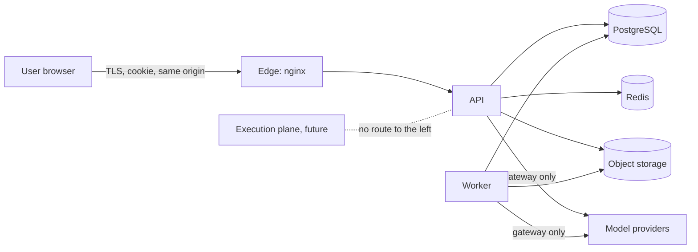

# OPSFORGE: Security architecture

Status: **Proposed, awaiting approval.** Written 2026-10-09. This document is the design. [SECURITY.md](SECURITY.md) is the **baseline that exists today** (gate G10) and lists the checks that run; read it for what is built. Here, each section marks **Built** or **Designed**.

Related: [ARCHITECTURE.md](ARCHITECTURE.md), [DATA_ARCHITECTURE.md](DATA_ARCHITECTURE.md), [AI_ARCHITECTURE.md](AI_ARCHITECTURE.md). Decisions: [ADR-0005](ADR/0005-identity-and-persistence.md), [ADR-0006](ADR/0006-llm-providers-and-secrets.md), [ADR-0007](ADR/0007-terminal-and-lab-sandbox.md), [ADR-0010](ADR/0010-authorization-model.md), [ADR-0012](ADR/0012-observability.md). Requirements: NFR-SEC-01 to NFR-SEC-10 ([NON_FUNCTIONAL_REQUIREMENTS.md](NON_FUNCTIONAL_REQUIREMENTS.md)), PR-19.

## 1. Scope and stance

OPSFORGE holds one sensitive kind of data: **personal career material** (resumes, runbooks, interview answers) plus accounts. It ships no payment data and no cloud credentials. It runs, by design, **no user-supplied code on a server**. These two facts keep the attack surface small, and the design protects them rather than adding controls on top.

Stance: secure by default, deny by default, least privilege, and **no secret in a place a browser can read**.

## 2. Assets

| Asset | Why it matters | Where it lives |
| --- | --- | --- |
| Accounts and session tokens | Account takeover | PostgreSQL (hashes only) and the user's cookie |
| Uploaded documents, resume text, runbooks | Personal and possibly employer-confidential | Object storage, chunks in PostgreSQL |
| Evidence and readiness history | Private performance record | PostgreSQL |
| Provider API keys | Cost abuse, data leakage to a third party | API and worker environment only |
| `SECRET_KEY` and database credentials | Full compromise | Environment or secret manager |
| Integrity of scores | The product's claim is that scores are trustworthy | Deterministic code and append-only evidence |

## 3. Trust boundaries

| Boundary | Crossing | Controls |
| --- | --- | --- |
| Internet to edge | Everything from a browser | TLS at the edge (production), security headers, CSP, body-size limit, rate limits |
| Edge to API | `/api` proxy | Same origin only; API trusts forwarded headers only from `API_TRUSTED_PROXIES` |
| API to data stores | Credentials in environment | Least-privilege database role, network-private services, no public ports for Postgres, Redis or the object store in production |
| API or worker to model provider | The only outbound call carrying user text | The P1 gateway: redaction, budget, allowlisted providers, keys from environment |
| Any code to a user's file bytes | Parsing untrusted files | Worker only, resource limits, no execution of content |
| Future execution plane | Running user commands | Separate network, no credentials, own ADR (section 11) |

**Untrusted input includes:** every request body, every uploaded file, every retrieved chunk, every model output, and every header the edge did not set.

## 4. Authentication

**Built** ([ADR-0005](ADR/0005-identity-and-persistence.md)):

- Email and password. Passwords hashed with scrypt; the hash never leaves the service layer.
- An opaque random session token in the `opsforge_session` cookie: `httpOnly`, `SameSite=Lax`, path `/api`, `Secure` in production. Only the SHA-256 of the token is stored in `auth_sessions`, so a database leak yields no usable session. Sessions last 14 days; deleting the row signs that browser out.
- Login lockout and a registration throttle, in-process. `API_TRUSTED_PROXIES` controls which client address is believed.
- The production configuration guard refuses to start with a weak or default secret.

**Designed, in this order:**

| Item | Detail |
| --- | --- |
| Shared throttles | Move login lockout and registration limits from process memory to Redis before a second API replica runs |
| CSRF | `SameSite=Lax` plus same-origin API is the current defence. Add a double-submit token header for state-changing routes before any cross-origin client or `SameSite=None` use |
| Sign-out everywhere | Delete all of a user's `auth_sessions`; run on password change |
| Account recovery and email verification | Needed before hosted use. Requires an outbound email provider, so it is a decision, not a default |
| MFA | TOTP first. Optional per user, then required for the `admin` role |
| External identity | OIDC replaces only the "resolve actor from request" dependency (section 5), leaving services and policies unchanged |
| Session hygiene | Add `last_seen` and a client descriptor; list and revoke sessions in the account page |

## 5. Authorization

Decision: [ADR-0010](ADR/0010-authorization-model.md). **Designed.** Built today: session authentication on user routes, and `user_id` scoping in the snapshot service.

### 5.1 Model

- **Actor.** A request dependency resolves the cookie to an `Actor(user_id, roles, session_id)` or rejects it. Services receive the actor as an argument and never read the request.
- **Roles.** `user` (everyone) and `admin` (operator: usage, jobs, erasure). There is no role that can read another user's personal data.
- **Ownership.** Every user-owned row has `user_id`. Repositories take the actor and filter by it; a query that does not is a defect.
- **Policy.** One function, `can(actor, action, resource)`, in the service layer, answers every permission question. Routers and UI do not decide permissions. The UI hides what the API would refuse and is never the control.
- **Content.** System content (seeded questions, scenarios) is readable by all and writable by no API route; it changes through a repository release.
- **Tenancy.** A later `workspace_id` and role grants (mentor, reviewer) extend ownership; PostgreSQL row-level security is added then as defence in depth, with the application setting a per-request `app.user_id`.

### 5.2 Rules that are tested, not assumed

1. **Route allowlist test (built).** The OpenAPI paths must match a reviewed list, so a new route cannot appear silently.
2. **Authentication test (built, extended per route).** Every route except health, register and login rejects an unauthenticated call.
3. **Isolation suite (designed, phase 44).** Two users, every route that takes or returns an id: user B can neither read nor change user A's rows and receives `404`, not `403`, so existence does not leak.
4. **No-command-route test (built).** `test_no_route_accepts_a_command_to_run`.

## 6. Secrets

| Secret | Rule |
| --- | --- |
| Provider API keys, `SECRET_KEY`, database and Redis passwords, object-store keys | Environment only, loaded into `SecretStr`, never logged, never returned by any route, never in the browser bundle (NFR-SEC-02) |
| In the repository | Only `.env.example` with empty or obviously fake values. A secret scan runs in CI and in a pre-commit hook (**designed**) |
| In Compose | `.env` file excluded from git; compose files reference variables, not literals, for secrets |
| In production | A secret manager (Kubernetes Secret, cloud secret store) mounted as environment. Rotation = redeploy |
| Per-user provider keys | Not supported ([ADR-0006](ADR/0006-llm-providers-and-secrets.md)); revisit with an encrypted store and a key-management decision |
| Database | Passwords hashed; session tokens hashed; no key material stored |

The production configuration guard (**built**) refuses to start when `SECRET_KEY` is weak, CORS is a wildcard, or the database URL is the default.

## 7. Transport, headers and edge

**Built:** security headers (including a strict CSP) from the API and from nginx for the static app, 2 MiB request body limit, and `Secure` cookies in production.

**Designed:**

- TLS terminates at the edge in any hosted setup; HSTS is enabled only there.
- The WebSocket endpoint ([ADR-0014](ADR/0014-realtime-channel.md)) authenticates with the same cookie, checks `Origin` against the configured allowlist on upgrade, caps message size and rate, and closes on session expiry.
- Postgres, Redis and the object store publish no ports outside the Compose or cluster network in any non-development configuration.

## 8. AI-specific threats

Detail and controls are in [AI_ARCHITECTURE.md](AI_ARCHITECTURE.md). Summary:

| Threat | Control |
| --- | --- |
| **Prompt injection** in an uploaded document, answer or retrieved chunk | Untrusted text is data, delimited and never concatenated into instructions. Model output is only parsed against a closed schema. The model has **no tools** that act on the system; it cannot write a score, call a route or read another user's data (NFR-SEC-09) |
| **Score manipulation** by crafting an answer that talks the model into a high grade | A model emits evidence dimensions chosen from a closed vocabulary; deterministic code turns them into evidence and weights; a model-assisted basis is labelled and can be down-weighted. No model output is a score (PR-04, PR-05) |
| **Data leakage to a cloud provider** | Off by default (`AI_CLOUD_ENABLED`); PII and secret redaction before any cloud call; provider allowlist; local Ollama is the default (NFR-SEC-10) |
| **Cross-user retrieval** | The retrieval function applies the owner filter in SQL before ranking; there is no other path to chunks |
| **Cost abuse** | Daily and monthly budgets per provider and per user in `ai_usage`; per-user rate limits on AI routes |
| **Malicious or oversized files** | Parsing in the worker with limits; type allowlist; no execution; scan hook before a file is shared back |
| **Hallucinated authority** | Retrieval answers cite chunk ids or say they cannot; generated items inherit and show provenance (PR-03) |
| **Sensitive data in logs** | Prompts and responses are not logged; `ai_usage` stores sizes, model and outcome only |

## 9. Audit logging

Requirement NFR-SEC-04. **Designed. Not built.**

- A dedicated append-only `audit_log` table (insert-only trigger, no delete grant), separate from application logs and from evidence.
- Recorded: sign-in success and failure, sign-out, password change, role change, session revoke, document upload and delete, account erasure, export, admin actions, provider enablement and budget changes, and denied authorization on a resource that exists.
- Fields: actor, action, subject, outcome, request id, client address (as seen through the trusted proxy), timestamp. **No** document text, prompt text or secret.
- Written in the same transaction as the action when the action is a database change, so there is no action without a record.
- Retention in [DATA_ARCHITECTURE.md](DATA_ARCHITECTURE.md) section 9. Reading the log needs the `admin` role and is itself audited.

## 10. Abuse resistance and availability

| Concern | Control |
| --- | --- |
| Credential stuffing | Per-account and per-address lockout (built, in process); shared in Redis (designed) |
| Mass registration | Registration throttle (built, in process) |
| Large bodies and slow clients | 2 MiB limit (built); server timeouts at the edge |
| Expensive routes | Per-user rate limits on AI, upload and re-index routes, enforced in Redis; AI routes are also bound by budgets |
| Queue flooding | Per-user cap on queued jobs; separate `ai` and `ingest` queues |
| Dependency risk | `npm audit` and `pip-audit` clean at G10; to run in CI and weekly (designed); lockfiles committed; images pinned by version |
| Container hardening | Non-root user, read-only root filesystem where possible, no writable state, minimal base image (partly built) |

## 11. Execution plane (future)

Not built and not authorised. [ADR-0007](ADR/0007-terminal-and-lab-sandbox.md) says what a real execution environment must meet before it can be proposed. This section adds the architectural requirements so that decision starts from a shared baseline.

| Requirement | Detail |
| --- | --- |
| Isolation | One short-lived environment per attempt, rootless containers with a hardened runtime (gVisor or Kata) or a microVM. Never the host Docker socket |
| Network | A dedicated network with no route to the API, database, Redis, object store or the internet by default. An explicit egress allowlist per lab, if any |
| Identity | The environment holds no credential from the platform and no cloud credential (NFR-SEC-07). Results return as events through a one-way channel the platform pulls from |
| Limits | CPU, memory, process count, disk and wall-clock limits; killed on breach; destroyed on completion or timeout |
| Orchestration | Owned by a separate service account and, if extracted, a separate deployment. The API requests an environment and never speaks to it as the user |
| Scoring | The same deterministic scorer over an event log. The environment's own output is untrusted data |
| Observation | Every command and lifecycle event recorded for audit and for evidence |
| Decision | Needs its own ADR and a threat review before code ([ARCHITECTURE.md](ARCHITECTURE.md) section 11) |

## 12. Known gaps

The baseline gaps from [SECURITY.md](SECURITY.md), with the phase or decision that closes each. Nothing here is hidden by the design above.

| Gap | Closes in |
| --- | --- |
| No CSRF token (relies on `SameSite=Lax` and same origin) | Before any cross-origin client; section 4 |
| No audit log | Phase 44 (section 9) |
| No tenant isolation test suite | Phase 44 (section 5.2) |
| Rate limits are per process | With the Redis work, before a second replica (section 10) |
| No account recovery, email verification or MFA | Decision needed (D-04); section 4 |
| No roles | Phase 44 ([ADR-0010](ADR/0010-authorization-model.md)) |
| No secret scanning in CI | Phase 45 |
| No encrypted secret store, no key rotation procedure | Before hosted operation |
| No privacy policy for uploaded personal material | D-04 |
| No third-party penetration test | Before real users |

## 13. Review triggers

Update this document and re-run a threat review when any of these appear: the first provider key in an environment, the first uploaded file, the first role other than `user`, any route that accepts a command, any cross-origin client, the first hosted deployment, or the execution plane.
